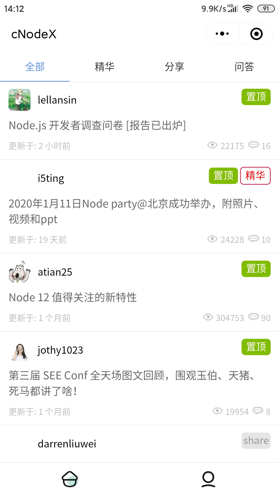
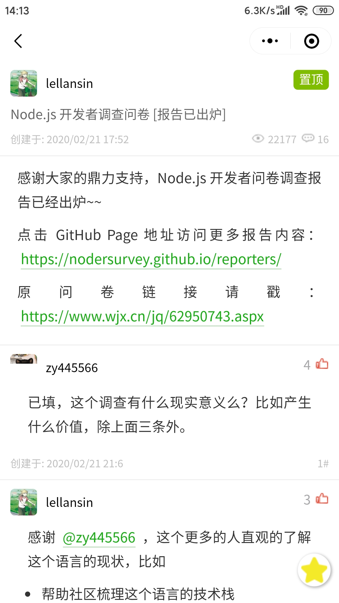
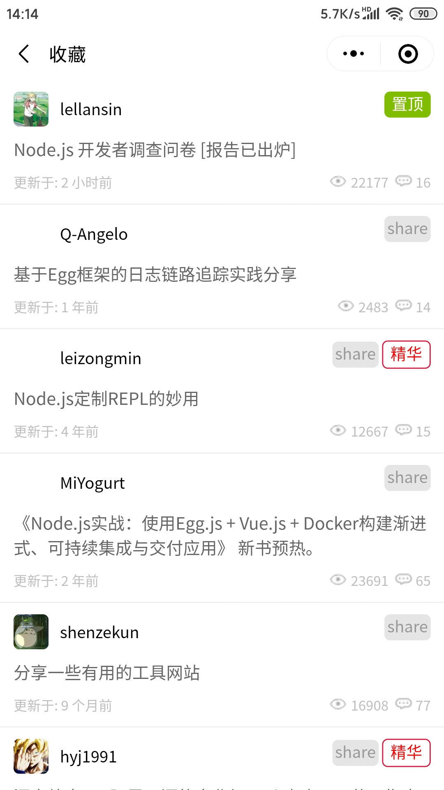

### cNodeX

本仓库是`cNodeX`小程序对应的开源仓库。

该项目采用 [Taro](https://taro.aotu.io/) + [Taro UI](https://taro-ui.aotu.io)  + [dvajs](https://dvajs.com/)进行开发，小程序内数据均来自于[cNode中文社区](https://cnodejs.org/api)


感谢相关作者的努力及开源精神。

### 说明

- `markdown`解析采用[towxml](https://github.com/sbfkcel/towxml)库，可以做到完美解析，但现在还不支持复制帖子功能
- 在内存不够的机子上文章加载可能比较久，因为是实时解析的，后面考虑把解析放到云函数上
- 使用`accessToken`登录，可以手动输入`token`，也可以扫码登录
- Token的生成方式，首先要拥有一个cNode账号，然后打开[设置](https://cnodejs.org/setting)页面，滑动到最下方
- **此源码仅供交流学习，严禁以任何形式独立发布或用于商业用途；**

### 使用

``` 
git clone https://github.com/ikomom/cNodeX.git
cd cNodeX

yarn install
```

使用方法请参考：
[Taro 安装及使用](https://nervjs.github.io/taro/docs/GETTING-STARTED.html)

自动生成页面模板
```
npm run script:tep [Page Name] # 创建页面
npm run script:com [Component Name] # 创建组件
```

### 扫码体验

扫码访问小程序:


## 部分页面展示
|Home|Article|
| :---: | :---: |
| | |
|Mine|Collect|
| | |

### Todo

- [x] 完善 `Markdown` 解析
- [x] 登录功能
- [x] 收藏功能
- [ ] 查看别的用户收藏
- [ ] 夜间模式
- [ ] ...


### LICENSE

[Apache License 2.0](./LICENSE)

### 学习链接

[JavaScript 时间与日期处理实战:你肯定被坑过](https://segmentfault.com/a/1190000007581722)

[如何使用yarn&如何用yarn配置node-sass](https://www.jianshu.com/p/b37aa202da5c)

[Taro+dva+Typescript 搭建微信小程序架构](https://segmentfault.com/a/1190000019914194)

[使用stylelint对CSS/Sass做代码审查](https://www.cnblogs.com/exhuasted/p/6185887.html)

[nodejs 执行失败报错 “JavaScript heap out of memory” 的解决办法](https://lzw.me/a/angular-javascript-heap-out-of-memory.html)

[小程序如何避免setData的列表数据过大](https://www.cnblogs.com/xuhuang/p/10606499.html)

[Gitter - 高颜值GitHub小程序客户端诞生记](https://juejin.im/post/5c4c738ce51d4525211c129b#heading-0)
